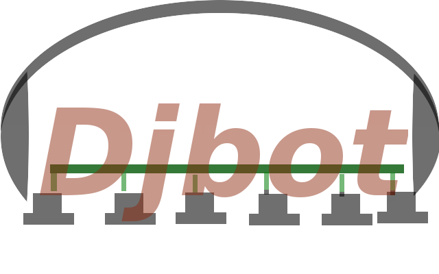

:title: DjBot
:author: Vizcaino, Aldo María
:description: Administrando las salas de PC evitando la consola
:keywords: Django, Botnet, Fabric, Python, Redis
:css: estilo.css

----
:data-scale: 1000

 
----

El Problema
===========

- Tres salas de PC (80 equipos)

   - Dos sistemas operativos (GNU/Linux Lihuen - Microsoft Windows)

   - Software instalado que necesita ser actualizado

   - Software nuevo solicitado por las cátedras

----

El Problema
===========
Parte 2
-------

- Repetición de tareas

- Horarios de uso de salas

   - Aula-1-1_

   - Aula-8_

   - Aula-120_

 .. _Aula-1-1: http://www.info.unlp.edu.ar/articulo/2010/8/2/horario_aula_1_1

 .. _Aula-8: http://www.info.unlp.edu.ar/articulo/2010/8/6/horario_aula_8

 .. _Aula-120: http://www.info.unlp.edu.ar/articulo/2010/8/6/horario_aula_120

----

:data-y: r1000

   .. image:: images/aula8.png 

----

   .. image:: images/aula11.png

----

   .. image:: images/aula120.png

----

:data-x: r3000

Una posible solución
====================

- Parallel-ssh

  - Consola

  - Escribir Scripts

----

DjBot
=====

- Interfaz web
- Tareas reutilizables
- Facilidad para agregar, editar y eliminar computadoras al sistema
- Las tareas son ejecutadas por sala

----

Productos utilizados
====================

- Django
- Rqworker
- Redis
- Sqlite
- Ssh
- Bootstrap

----

:data-scale: 5
:data-rotate: 90
:data-y: r6000

DEMO
====

----

El Futuro
---------

- Diseño amigable
- Completar la integración con etherwake (Wake on LAN)
- Consola interactiva_ para verificar las tareas

 .. _interactiva: http://tryruby.org/levels/1/challenges/0

----

Compartir Conocimiento
----------------------
- *GitHub*
- **Hovercraft**
- Todas las *ideas* son bien recibidas!
- DjBot_ ( https://github.com/krahser/djbot )

.. _DjBot: https://github.com/krahser/djbot

----

Aldo María Vizcaino
-------------------

avizcaino@linti.unlp.edu.ar
soporte@linti.unlp.edu.ar

