

<h2>&Iacute;ndice</h2>

<ul>
<li><a href="#orgheadline4">1. Introducción</a>
<ul>
<li><a href="#orgheadline1">1.1. Motivación</a></li>
<li><a href="#orgheadline2">1.2. Objetivos</a></li>
<li><a href="#orgheadline3">1.3. Contribuciones</a></li>
</ul>
</li>
<li><a href="#orgheadline13">2. Estado del arte</a>
<ul>
<li><a href="#orgheadline5">2.1. Arquitectura de red</a></li>
<li><a href="#orgheadline10">2.2. Administración de salas</a>
<ul>
<li><a href="#orgheadline6">2.2.1. Manual</a></li>
<li><a href="#orgheadline7">2.2.2. Remota</a></li>
<li><a href="#orgheadline9">2.2.3. Centralizada</a></li>
</ul>
</li>
<li><a href="#orgheadline12">2.3. DevOps</a>
<ul>
<li><a href="#orgheadline11">2.3.1. Docker</a></li>
</ul>
</li>
</ul>
</li>
<li><a href="#orgheadline19">3. Solución propuesta</a>
<ul>
<li><a href="#orgheadline14">3.1. Ejecución de tareas</a></li>
<li><a href="#orgheadline15">3.2. Modelado de datos</a></li>
<li><a href="#orgheadline16">3.3. Diseño de interacciones</a></li>
<li><a href="#orgheadline17">3.4. Desarrollo web</a></li>
<li><a href="#orgheadline18">3.5. Integración de componentes: DJBot</a></li>
</ul>
</li>
<li><a href="#orgheadline29">4. Implementación y resultados</a>
<ul>
<li><a href="#orgheadline26">4.1. Instalación</a>
<ul>
<li><a href="#orgheadline20">4.1.1. Red</a></li>
<li><a href="#orgheadline21">4.1.2. DJBot</a></li>
<li><a href="#orgheadline24">4.1.3. Conexión Administrador-DJBot</a></li>
<li><a href="#orgheadline25">4.1.4. Conexión DJBot-Salas</a></li>
</ul>
</li>
<li><a href="#orgheadline27">4.2. Uso</a></li>
<li><a href="#orgheadline28">4.3. Validación</a></li>
</ul>
</li>
<li><a href="#orgheadline31">5. Conclusión</a>
<ul>
<li><a href="#orgheadline30">5.1. Trabajos futuros</a></li>
</ul>
</li>
</ul>

\newpage  

# Introducción

En el presente trabajo de grado se analiza la metodología de trabajo aplicada en la administración de salas de computadoras de la Facultad de Informática de la Universidad Nacional de La Plata (UNLP), y se propone una solución para mejorar el manejo de las salas. La disponibilidad limitada de las salas para realizar las tareas de mantenimiento y la necesidad de repetición de una misma tarea en cada una de las máquinas por parte del administrador fueron los disparadores de la solución aquí propuesta. Sobre la base de una primera versión desarrollada en 2013 [@djbotv1], la solución fue mejorada haciendo hincapié en el usuario final del sistema y en el alcance de las tareas que se pueden realizar.  

Mediante la integración de cuatro herramientas principales de código abierto, se compone la nueva versión de nuestra solución: DJBot. DJBot es una aplicación web para administrar salas de computadoras, que se caracteriza por su facilidad de uso y por la simplicidad en la definición de tareas.  

## Motivación

La administración de salas de computadoras implica la repetición de una misma tarea en cada una de las máquinas que conforman las salas. Esta repetición de tareas representa una pérdida de tiempo doble. Se consume tiempo de las salas que podría destinarse a la realización de actividades académicas, y se desperdicia tiempo valioso del administrador. En el mejor de los casos, las tareas de administración se realizan fuera del horario laboral.  

Al mismo tiempo, el mercado de tecnologías de software ofrece múltiples alternativas para la automatización de tareas. En los últimos años, se han creado herramientas para simplificar el flujo de trabajo y la integración entre distintos sistemas. Dentro de la industria, esta metodología de trabajo se conoce con el nombre de “orquestación”. Por “orquestar” se entiende ‘la organización de distintos instrumentos y la definición de la interacción entre ellos, de manera que vibren al unísono’. Estas herramientas ofrecen un amplio abanico de posibilidades a la hora de resolver problemas, pero también requieren un nivel de conocimiento avanzado en materia de redes y seguridad informática.  

El panorama de la Facultad de Informática entre 2011 y 2013 se puede describir en forma resumida en tres etapas diferentes. En un principio, el trabajo estaba a cargo de un equipo de seis administradores que realizaban las tareas a mano, máquina por máquina. Luego, el trabajo se simplificó mediante la ejecución remota, es decir que un solo usuario realizaba las tareas en cada una de las máquinas mediante una conexión de SSH<a id="fnr.1" class="footref" href="#fn.1">1</a>. Finalmente, se analizaron distintas alternativas para la administración centralizada de las máquinas; pero ante la dificultad inherente de las opciones encontradas, se creó la primera versión de DJBot, que permitía completar las tareas a través de una aplicación web. Así y todo, era evidente que la herramienta necesitaba mejorar la manera de definir y de procesar las tareas. Los usuarios enfrentaban ciertas dificultades a la hora de entender cómo trabajar con la aplicación.  

La segunda versión de DJBot se plantea, entonces, como una solución intermedia entre las soluciones antiguas aplicadas en la Facultad y el complejo abanico de soluciones que podrían desarrollarse a partir de las herramientas disponibles en el mercado.  

## Objetivos

El objetivo principal de este trabajo apunta a administradores de salas de computadoras. Se busca desarrollar una aplicación web, simple de usar e intuitiva, que permita realizar instalaciones y actualizaciones en sistemas operativos GNU<a id="fnr.2" class="footref" href="#fn.2">2</a>/Linux de manera sencilla.  

Los objetivos secundarios, por su parte, están dirigidos a desarrolladores y a la comunidad académica del campo de la informática. Se pretende informar sobre la existencia de herramientas de software específicas, y se busca poner en evidencia el potencial de las herramientas disponibles en el mercado. Se espera, además, despertar el interés por las nuevas herramientas, para que tanto alumnos como profesionales puedan mantenerse a la cabeza de los desarrollos tecnológicos del sector.  

La aplicación web permitirá agregar salas, definir tareas, realizar la ejecución de una tarea en una sala y verificar los resultados. Se describirá, además, un ejemplo de configuración de un servidor caché, para reducir el volumen de datos que será necesario descargar desde internet para cada instalación o actualización del gestor de paquetes de la distribución Debian GNU/Linux.  

Para cerrar, se planea lograr una capa de abstracción suficiente para alcanzar un alto nivel de distribución de la herramienta, y para facilitar su instalación.  

## Contribuciones

A través del presente trabajo se hacen contribuciones de dos tipos: intelectuales y materiales.  

Por un lado, se expone el conocimiento sobre distintas herramientas de software. Como es de esperarse, cada uno de los componentes de software que integran nuestra solución tiene su propia estructura de funcionamiento. Antes de comenzar a trabajar con ellos y para evitar fallas en su comportamiento o errores de compatibilidad entre herramientas, es necesario comprender sus mecanismos de funcionamiento al máximo detalle.  

En este trabajo, se brinda la información necesaria sobre la estructura de funcionamiento de cada una de estas herramientas. Sin entrar en un nivel de detalle avanzado, se facilita la comprensión global de las herramientas, mediante la abstracción conceptual de los mecanismos y las funciones que las conforman.  

Por el otro lado, se documenta el desarrollo de un sistema para realizar tareas de administración en salas de computadoras de manera sencilla. Como valor agregado, se ofrece una alternativa para simplificar y reducir la descarga y la instalación de nuestra herramienta en un solo paso. Con el objetivo de reducir al máximo la exposición y la vulnerabilidad de la herramienta en la red, se describe, además, un modo de conexión exclusiva para administradores.  

Se ofrece una guía paso a paso pensada para los administradores, en la que se detalla la implementación de la herramienta. En esta guía se trata, específicamente, la instalación de DJBot, con recomendaciones de uso en cuanto a su exposición; la creación de salas; la creación de tareas; y el uso de la herramienta.  

\newpage  

# Estado del arte

En esta sección se describirá una posible arquitectura de red de salas de computadoras para entidades académicas. Se expondrán distintas maneras de administrar las salas: se presentarán opciones de trabajo en orden sucesivo e incremental, desde la administración manual computadora por computadora, pasando por la administración también manual pero a través de SSH, hasta llegar a la administración automática y centralizada. Se introducirá, además, el concepto de *DevOps*; perfil clave para la automatización de tareas. Con todo esto, se dejará planteado el contexto que da lugar al desarrollo de nuestra solución.  

Debe tenerse en cuenta que si bien el marco donde surgió la herramienta propuesta fue la situación real de administración de salas de computadoras de la Facultad de Informática de la UNLP, nuestra solución está pensada para que pueda ser aplicada en cualquier tipo de arquitectura de red. Vale aclarar, también, que aun estando desarrollada para funcionar con las distintas distribuciones del sistema operativo GNU/Linux, en este caso en particular se utiliza para administrar la distribución Debian; base para el desarrollo de Lihuen por parte de la Facultad.  

## Arquitectura de red

Actualmente, la Facultad de Informática cuenta con tres salas de computadoras, con un total aproximado de 80 equipos, que se utilizan para dictar clases y para realizar competencias, jornadas específicas y otras actividades extracurriculares. Las tres salas se encuentran conectadas a la red troncal de la Facultad mediante una topología de estrella con un *switch* administrable. Como nodo central se utiliza un *router*, que limita el acceso desde internet y utiliza direccionamiento IPv4<a id="fnr.3" class="footref" href="#fn.3">3</a> público para permitir que los equipos de la sala sean identificados. Para facilitar la configuración de los dispositivos, el *router* usa el protocolo de configuración de direcciones IP<a id="fnr.4" class="footref" href="#fn.4">4</a> dinámicas DHCP<a id="fnr.5" class="footref" href="#fn.5">5</a>.  

En la figura que aparece a continuación se observa una topología tradicional de salas de computadoras:  

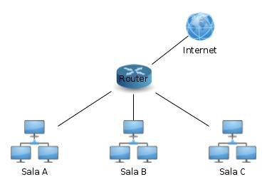  

## Administración de salas

Dependiendo de la disponibilidad de recursos y de los fines específicos, las salas de computadoras se pueden administrar de distintas maneras.  

### Manual

La administración manual en la que las tareas de configuración, instalación y actualización se realizan en persona, máquina por máquina, es la más básica de las opciones disponibles. Como tal, presenta varias desventajas, como aumentar el margen de error y usar recursos &#x2013;humanos y técnicos&#x2013; innecesarios. El tiempo requerido para completar la tarea de administración de una sala se ve incrementado en proporción a la cantidad de dispositivos que conforman la sala. La implementación de esta metodología hace que el administrador desperdicie tiempo valioso en la repetición de tareas, y que la sala de computadoras quede inhabilitada para su uso durante el período de trabajo.  

### Remota

Para revertir, al menos en parte, la situación antes mencionada, existe la posibilidad de trabajar a distancia, desde una computadora externa a la red pero habilitada para conectarse con ella. Esta opción ofrece la ventaja de que el administrador no necesita estar físicamente presente en la sala para realizar su trabajo. Para este fin, se usa el protocolo seguro para la ejecución remota de comandos, SSH.  

SSH permite la conexión directa entre la computadora del administrador y cada una de las computadoras de la sala. Estas conexiones admiten dos modalidades. Por un lado, el acceso a las computadoras se puede validar mediante el uso de un nombre de usuario y una contraseña. Por el otro, la validación se puede realizar mediante la presentación de una clave asimétrica RSA<a id="fnr.6" class="footref" href="#fn.6">6</a>.  

Las claves asimétricas consisten en un par de claves: una pública y una privada. Ambas se crean en la computadora local. La clave privada no debe ser compartida bajo ninguna circunstancia. La pública, sin embargo, se copia en cada una de las máquinas remotas. La computadora local inicia un pedido de conexión con una computadora remota. La remota responde a ese pedido con un mensaje aleatorio. La local cifra ese mensaje usando su clave privada, y lo manda a la remota. La remota descifra el mensaje cifrado usando su clave pública. Si el mensaje que obtiene como resultado del descifre coincide con el mensaje aleatorio que envió al principio, se establece la conexión. Esto es prueba de que la clave privada usada para cifrar el mensaje y la clave pública usada para descifrar el mensaje cifrado corresponden al mismo par de claves. Así, se garantiza la autenticación segura de la máquina remota.  

En este tipo de conexión asimétrica, a la hora de trabajar, el administrador solo debe ingresar su nombre de usuario, y es el sistema quien se encarga de validar la correlación entre las claves existentes.  

### Centralizada

La misma tecnología de conexión remota puede implementarse de manera que la computadora del administrador se conecte con todas las computadoras de la sala al mismo tiempo. La idea de esta metodología de trabajo es que la administración de las máquinas se realice en forma simultánea. Así, no solo que el administrador sigue manteniendo el control remoto de la sala, sino que se suma una ventaja de gran valor: la optimización del factor tiempo. El administrador ya no está obligado a repetir la misma tarea en múltiples instancias, y la sala queda libre para que el personal de la Facultad pueda realizar actividades académicas la mayor parte del tiempo.  

En principios generales, para establecer una conexión remota y simultánea, se puede pensar en soluciones de bajo y de alto nivel. Un ejemplo de bajo nivel es la librería Parallel-SSH para la ejecución de comandos SSH asincrónicos en múltiples dispositivos. Esta solución requiere que el administrador programe una aplicación específica cada vez que desee realizar cambios en una sala de computadoras. La aplicación debe incluir la lista de computadoras sobre las que quiere trabajar, la lista de tareas que desea realizar, y la manera de ejecutar esas tareas en esas computadoras. Si bien Parallel-SSH ofrece una solución viable, exige que el administrador cuente con conocimientos avanzados en la materia.  

Un ejemplo de alto nivel para la administración centralizada de múltiples equipos es la aplicación web DJBot, que trabaja a través de una interfaz web. Esta herramienta nace en el Laboratorio de Investigación en Nuevas Tecnologías Informáticas (LINTI) hacia el año 2013. El agregado de una interfaz significa, entre otras cosas, que las tareas de administración pueden ser realizadas por personal técnico no especializado; y que se puede obtener el mismo resultado que trabajando con Parallel-SSH, pero hacerlo en menos tiempo y con menor riesgo de cometer errores. Por su parte, el hecho de que DJBot sea una aplicación web significa que el administrador no se ve obligado a recargar su máquina con la instalación de software nuevo y, al mismo tiempo, puede hacer uso de la herramienta desde diferentes dispositivos habilitados para tal fin.  

La experiencia de aproximadamente dos años de trabajo con todas las metodologías antes descriptas dejó demostrado que DJBot era la herramienta más adecuada para administrar las salas de computadoras de manera práctica y efectiva.  

1.  DJBot

    La falta de un producto específico para administrar salas de computadoras sin la necesidad de acceder a una consola motivó el desarrollo de DJBot. DJBot es una aplicación escrita en Python [@Python], desarrollada a partir de la interacción entre librerías y herramientas de software libre. En esta primera versión de la herramienta, las conexiones de SSH entre el servidor y cada una de las máquinas de las salas se establecía a través de la librería Fabric [@Fabric], escrita en Python. La ejecución de las tareas se realizaba mediante la librería RQ<a id="fnr.7" class="footref" href="#fn.7">7</a> en Redis [@Redis], es decir, mediante el procesamiento en cola de las tareas en una estructura de datos en memoria. La interfaz web para que el administrador pudiera definir las salas y escribir las tareas que deseaba realizar se desarrolló con el framework Django [@Django], también escrito en Python.  
    
    DJBot se está implementando en la administración de las tres salas de computadoras de la Facultad desde el año 2013, y ha demostrado ser de utilidad para:  
    
    -   instalar el software solicitado por las cátedras para la realización de actividades académicas;
    -   actualizar el sistema operativo ante mejoras relacionadas con la funcionalidad y la seguridad de las distintas herramientas instaladas; y para
    -   realizar pruebas de esfuerzo para determinar la respuesta de un servidor web.
    
    Si bien la herramienta ha dado respuesta a los objetivos iniciales del proyecto, especialmente a la automatización de tareas, la experiencia del usuario no ha sido la más sencilla. El diseño y la falta de claridad en cuanto al manejo de la aplicación interfirieron en el uso y en la difusión de DJBot. Hoy en día, se espera implementar la segunda versión, que promete una redefinición íntegra del concepto de DJBot.  

## DevOps

El término *DevOps* viene de la contracción de *Development* y *Operations*. Hace referencia al movimiento originado hacia 2008, que plantea una relación más ágil y una comunicación más fluida entre los departamentos de desarrollo y de operaciones de TI<a id="fnr.8" class="footref" href="#fn.8">8</a> de las empresas de desarrollo de software. La idea es fusionar los antiguos roles de desarrollador y de administrador de sistemas en un nuevo perfil (*DevOps*), con el objetivo final de implementar soluciones de manera rápida y de detectar y corregir los problemas en el momento en que ocurren, sin que interfieran en otros servicios.  

La cultura de *DevOps* incentiva la colaboración entre desarrolladores y administradores de sistemas. Persigue la automatización del proceso de desarrollo para alcanzar un ciclo de integración que permita la transferencia de un producto en desarrollo a producción de manera ágil y sencilla. Para este fin, han ido surgiendo distintas herramientas específicas, que facilitan la labor de los nuevos *DevOps*. Entre ellas podemos mencionar: Ansible [@Ansible], Chef [@Chef], Docker [@Docker], Kubernetes [@Kubernetes], Otter [@Otter], Puppet [@Puppet] y SaltStack [@SALTSTACK].  

En el marco de la cultura de *DevOps* &#x2013;y sobre la base de la primera versión de DJBot, cuyo objetivo principal era la automatización de tareas&#x2013;, se ha desarrollado la nueva versión de la solución. Esta segunda versión de DJBot basa su flujo de trabajo justamente en Ansible, que ofrece la agilidad del mundo de *DevOps*, al tiempo que mantiene el mismo lenguaje de programación y el mismo protocolo de conexión usados en la primera versión.  

### Docker

En consonancia con el principio de agilidad fomentado por la cultura de DevOps, se incluye, además, la plataforma de contenedores Docker, que en nuestro caso se utiliza tanto como entorno de pruebas para que los desarrolladores verifiquen la funcionalidad de DJBot, como para facilitarles las tareas de descarga e instalación de la herramienta a los administradores. Dado que la nueva versión de DJBot está compuesta por cuatro elementos principales, se buscó la manera de evitar que el administrador tuviera que lidiar con la instalación de múltiples componentes.  

El lema de Docker es diseñar, enviar y ejecutar aplicaciones en cualquier lugar. Para ese fin, se utilizan dos conceptos básicos: el de contenedores y el de imágenes. Un contenedor es un espacio donde la aplicación tiene todo lo necesario para funcionar correctamente. El hecho de que la aplicación esté aislada dentro de su contenedor ofrece dos ventajas principales. Por un lado, se garantiza que la aplicación funcionará libre de errores. Por el otro, se evitan posibles incompatibilidades de software. Una imagen es un sistema de archivos, y parámetros de uso para el momento de ejecución de la aplicación. Las imágenes no cambian. Son los contenedores los que representan las imágenes en ejecución.  

La plataforma Docker nos permite crear imágenes de software y compartirlas con otros usuarios. Así, los otros usuarios pueden usar el mismo software que nosotros, tal cual existe y tal cual se ejecuta en nuestro entorno. Con Docker no existe la posibilidad de que una computadora falle a la hora de ejecutar un software que se encuentra en una imagen de Docker. La ejecución está garantizada mediante el uso del contenedor.  

La forma tradicional de administración de salas de computadoras en entidades académicas, en la que los administradores trabajan físicamente en cada una de las máquinas, representa un obstáculo doble. Se necesita disponer de las salas por mucho tiempo para completar las tareas de actualización, instalación y configuración, y el personal a cargo desperdicia tiempo valioso en la repetición de estos trabajos. Con el objetivo de revertir esta situación, se pensó en una herramienta que permitiera administrar las salas de manera centralizada.  

Dado que frecuentemente el rol de administrador lo desempeña personal técnico no necesariamente capacitado en desarrollo de software, se buscó que la solución propuesta resultara sencilla y ágil para el usuario. Así, se creó DJBot, una aplicación web, de uso libre, basada en Ansible,  para “orquestar” salas de computadoras.  

\newpage  

# Solución propuesta

En esta sección se describirán las cuatro herramientas principales que conforman la aplicación DJBot. Partiendo del nivel de mayor abstracción, se explicará, de manera resumida, la funcionalidad, los componentes y el funcionamiento del motor que permite ejecutar las tareas (Ansible). Luego, se describirá brevemente la caja de herramientas para trabajar con bases de datos SQL<a id="fnr.9" class="footref" href="#fn.9">9</a> (SQLAlchemy [@SQLalchemy]), que se utiliza para modelar los datos. A continuación, se presentará el *microframework* que sirve para estructurar las interacciones entre los componentes de DJBot (Flask [@Flask]). Ya en la capa de más alto nivel, se describirá la librería para diseño de aplicaciones web usada para desarrollar la interfaz de usuario (React [@React]). Por último, se integrarán los cuatro componentes para crear la nueva versión de nuestra solución, lo cual nos permitirá redefinir el concepto de DJBot.  

## Ejecución de tareas

Ansible es una herramienta para automatizar tareas, escrita en Python. Permite, entre otras cosas, configurar servicios, administrar permisos de archivos y de usuarios, implementar productos de software y orquestar tareas avanzadas de administración de sistemas. Se caracteriza por ser simple y fácil de usar.  

La conexión entre la máquina central &#x2013;donde se encuentra Ansible&#x2013; y las computadoras remotas se establece a través del protocolo SSH. Para poder administrar las salas y las computadoras es necesario que estas figuren en un archivo de inventario. Este archivo define los parámetros de conexión para cada máquina remota y permite agrupar las computadoras según distintas configuraciones, utilizando variables específicas.  

Para definir las salas y las máquinas en las que se trabajará (*hosts*) y las tareas que se desean automatizar (*tasks*), se usan guías de ejecución, del inglés *playbooks*. Una guía de ejecución es un archivo escrito en YAML (.yml), que indica qué tareas hacer en qué máquinas. Para definir las tareas, la guía de ejecución ofrece una larga lista de módulos con parámetros específicos. Esta librería de módulos debe estar almacenada en la máquina central.  

Una vez escrita una guía de ejecución, Ansible envía los módulos, con sus parámetros, a las computadoras correspondientes, los ejecuta y, cuando se completan las tareas, los elimina de las máquinas. Los módulos, a su vez, devuelven un resultado a la máquina central, según el éxito de sus tareas. Los resultados posibles son:  

-   *OK*; el módulo se completó satisfactoriamente sin necesidad de hacer cambios en el sistema;
-   *Changed*; el módulo se completó satisfactoriamente tras haber realizado cambios en el sistema;
-   *Failed*; se encontró algún error en la ejecución del módulo; y
-   *Unreachable*; no se pudo establecer la conexión SSH.

A partir de aquí, Ansible reinicia el ciclo según sea necesario.  

Debe recordarse que la ejecución de los módulos respetará el orden en que aparecen definidos en la interfaz web.  

A modo de ejemplo, a continuación se presenta una guía de ejecución para la instalación del editor extensible de texto Emacs [@Emacs]:  

    ---
    - hosts: djbot_demo
      tasks:
        - apt:
            name: emacs
            state: present

donde la primera línea (&#x2014;) indica el inicio de un nuevo documento dentro de la guía de ejecución, la segunda define la máquina donde se ejecutará la tarea, la tercera crea la lista de tareas, y las siguientes definen el módulo para la gestión de paquetes en la distribución Debian, con los parámetros mínimos para su correcta ejecución.  

Una vez completada la tarea, el resultado devuelto por el módulo es el siguiente:  

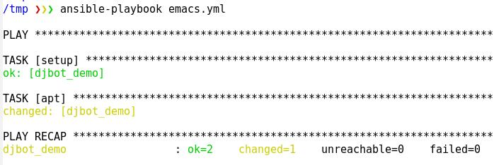  

Como se desprende de lo expuesto sobre Ansible, los módulos son el elemento esencial para el funcionamiento de la herramienta. Por lo tanto, pasamos a describir las funcionalidades básicas de algunos módulos relevantes para los fines de DJBot, junto con sus principales parámetros de configuración.  

<table>

<colgroup>
<col  class="org-left">

<col  class="org-left">

<col  class="org-left">
</colgroup>
<thead>
<tr>
<th scope="col" class="org-left">Módulo</th>
<th scope="col" class="org-left">Funcionalidad</th>
<th scope="col" class="org-left">Parámetros</th>
</tr>
</thead>

<tbody>
<tr>
<td class="org-left">*apt*</td>
<td class="org-left">administrar paquetes</td>
<td class="org-left">*name*: identifica el paquete</td>
</tr>

<tr>
<td class="org-left">&#xa0;</td>
<td class="org-left">en distribuciones Debian</td>
<td class="org-left">*state*: define el estado del paquete</td>
</tr>

<tr>
<td class="org-left">&#xa0;</td>
<td class="org-left">&#xa0;</td>
<td class="org-left">&#x2013;> *absent* (valor de state): garantiza que el paquete no está en la máquina</td>
</tr>

<tr>
<td class="org-left">&#xa0;</td>
<td class="org-left">&#xa0;</td>
<td class="org-left">&#x2013;> *present* (valor de state): garantiza que el paquete está instalado en la máquina</td>
</tr>
</tbody>

<tbody>
<tr>
<td class="org-left">*apt\_repository*</td>
<td class="org-left">agregar o quitar</td>
<td class="org-left">*repo*: determina la ruta de configuración del repositorio</td>
</tr>

<tr>
<td class="org-left">&#xa0;</td>
<td class="org-left">repositorios de software</td>
<td class="org-left">*state*: determina si el repositorio está presente o no</td>
</tr>
</tbody>

<tbody>
<tr>
<td class="org-left">*copy*</td>
<td class="org-left">transferir archivos</td>
<td class="org-left">*dest*: indica la ruta remota donde se copiará el archivo</td>
</tr>

<tr>
<td class="org-left">&#xa0;</td>
<td class="org-left">desde la máquina central</td>
<td class="org-left">*mode*: indica el permiso que debe tener el archivo</td>
</tr>

<tr>
<td class="org-left">&#xa0;</td>
<td class="org-left">a las máquinas remotas</td>
<td class="org-left">*owner*: indica el nombre del usuario que será propietario del archivo</td>
</tr>

<tr>
<td class="org-left">&#xa0;</td>
<td class="org-left">&#xa0;</td>
<td class="org-left">*src*: indica la ruta local del archivo que se copiará en la máquina remota</td>
</tr>
</tbody>
</table>

<table>

<colgroup>
<col  class="org-left">

<col  class="org-left">

<col  class="org-left">
</colgroup>
<thead>
<tr>
<th scope="col" class="org-left">Módulo</th>
<th scope="col" class="org-left">Funcionalidad</th>
<th scope="col" class="org-left">Parámetros</th>
</tr>
</thead>

<tbody>
<tr>
<td class="org-left">*docker*</td>
<td class="org-left">crear, borrar y</td>
<td class="org-left">*env*: le pasa un diccionario de variables de entorno al contenedor</td>
</tr>

<tr>
<td class="org-left">&#xa0;</td>
<td class="org-left">relacionar contenedores</td>
<td class="org-left">*hostname*: indica el nombre de host del contenedor</td>
</tr>

<tr>
<td class="org-left">&#xa0;</td>
<td class="org-left">&#xa0;</td>
<td class="org-left">*image*: indica la imagen que se usa para ejecutar el contenedor</td>
</tr>

<tr>
<td class="org-left">&#xa0;</td>
<td class="org-left">&#xa0;</td>
<td class="org-left">*links*: indica la lista de otros contenedores a los que se hará referencia desde el contenedor en cuestión</td>
</tr>

<tr>
<td class="org-left">&#xa0;</td>
<td class="org-left">&#xa0;</td>
<td class="org-left">*name*: indica el nombre del contenedor</td>
</tr>

<tr>
<td class="org-left">&#xa0;</td>
<td class="org-left">&#xa0;</td>
<td class="org-left">*ports*: ofrece una lista que relaciona los puertos del contenedor con los puertos de la máquina que lo hospeda</td>
</tr>

<tr>
<td class="org-left">&#xa0;</td>
<td class="org-left">&#xa0;</td>
<td class="org-left">*restart\_policy*: indica la política de reinicio del contenedor</td>
</tr>

<tr>
<td class="org-left">&#xa0;</td>
<td class="org-left">&#xa0;</td>
<td class="org-left">*state*: garantiza el estado deseado del contenedor:</td>
</tr>

<tr>
<td class="org-left">&#xa0;</td>
<td class="org-left">&#xa0;</td>
<td class="org-left">-> *absent* (valor): hace referencia al estado del contenedor; detiene y elimina el contenedor en cuestión</td>
</tr>

<tr>
<td class="org-left">&#xa0;</td>
<td class="org-left">&#xa0;</td>
<td class="org-left">-> *started* (valor): hace referencia al estado del contenedor; se asegura de que el contenedor exista y se esté ejecutando</td>
</tr>

<tr>
<td class="org-left">&#xa0;</td>
<td class="org-left">&#xa0;</td>
<td class="org-left">*volumes*: indica la lista de bultos que se montarán en el contenedor</td>
</tr>

<tr>
<td class="org-left">&#xa0;</td>
<td class="org-left">&#xa0;</td>
<td class="org-left">*volumes\_from*: indica la lista de contenedores desde los que se montarán bultos</td>
</tr>
</tbody>

<tbody>
<tr>
<td class="org-left">*fetch*</td>
<td class="org-left">transferir archivos desde</td>
<td class="org-left">*dest*: indica el directorio donde se guardará el archivo</td>
</tr>

<tr>
<td class="org-left">&#xa0;</td>
<td class="org-left">las máquinas remotas</td>
<td class="org-left">*src*: indica el archivo de la máquina remota</td>
</tr>

<tr>
<td class="org-left">&#xa0;</td>
<td class="org-left">a la máquina central</td>
<td class="org-left">&#xa0;</td>
</tr>
</tbody>

<tbody>
<tr>
<td class="org-left">*files*</td>
<td class="org-left">crear archivos o directorios,</td>
<td class="org-left">*mode*: configura los permisos del archivo</td>
</tr>

<tr>
<td class="org-left">&#xa0;</td>
<td class="org-left">asignarles atributos como:</td>
<td class="org-left">*owner*: configura el propietario del archivo</td>
</tr>

<tr>
<td class="org-left">&#xa0;</td>
<td class="org-left">propietario, grupo y permisos</td>
<td class="org-left">*path*: indica una ruta para un archivo</td>
</tr>

<tr>
<td class="org-left">&#xa0;</td>
<td class="org-left">&#xa0;</td>
<td class="org-left">*recurse*: configura los atributos específicos del archivo de manera recursiva</td>
</tr>

<tr>
<td class="org-left">&#xa0;</td>
<td class="org-left">&#xa0;</td>
<td class="org-left">*src*: indica un archivo sobre el cual se creará un enlace</td>
</tr>

<tr>
<td class="org-left">&#xa0;</td>
<td class="org-left">&#xa0;</td>
<td class="org-left">*state*: indica el estado del archivo o directorio</td>
</tr>

<tr>
<td class="org-left">&#xa0;</td>
<td class="org-left">&#xa0;</td>
<td class="org-left">-> *absent* (valor): elimina el directorio de manera recursiva o elimina el enlace del archivo</td>
</tr>

<tr>
<td class="org-left">&#xa0;</td>
<td class="org-left">&#xa0;</td>
<td class="org-left">-> *directory* (valor): define el tipo de archivo como directorio</td>
</tr>

<tr>
<td class="org-left">&#xa0;</td>
<td class="org-left">&#xa0;</td>
<td class="org-left">-> *file* (valor): define el tipo de archivo como archivo</td>
</tr>

<tr>
<td class="org-left">&#xa0;</td>
<td class="org-left">&#xa0;</td>
<td class="org-left">-> *link* (valor): establece el enlace entre una ruta y un archivo</td>
</tr>

<tr>
<td class="org-left">&#xa0;</td>
<td class="org-left">&#xa0;</td>
<td class="org-left">-> *touch* (valor): cuando no existe una ruta, crea un archivo vacío; cuando ya hay un archivo o directorio, actualiza los permisos y los tiempos de modificación</td>
</tr>
</tbody>
</table>

<table>

<colgroup>
<col  class="org-left">

<col  class="org-left">

<col  class="org-left">
</colgroup>
<thead>
<tr>
<th scope="col" class="org-left">Módulo</th>
<th scope="col" class="org-left">Funcionalidad</th>
<th scope="col" class="org-left">Parámetros</th>
</tr>
</thead>

<tbody>
<tr>
<td class="org-left">*git*</td>
<td class="org-left">descargar cualquier repositorio</td>
<td class="org-left">*accept\_hostkey*: agrega una clave remota a la lista de máquinas conocidas</td>
</tr>

<tr>
<td class="org-left">&#xa0;</td>
<td class="org-left">git en su última versión,</td>
<td class="org-left">*dest*: configura un directorio de destino para el repositorio</td>
</tr>

<tr>
<td class="org-left">&#xa0;</td>
<td class="org-left">o en una versión específica</td>
<td class="org-left">*version*: descarga la versión de repositorio indicada</td>
</tr>

<tr>
<td class="org-left">&#xa0;</td>
<td class="org-left">&#xa0;</td>
<td class="org-left">&#xa0;</td>
</tr>
</tbody>

<tbody>
<tr>
<td class="org-left">*iptables*</td>
<td class="org-left">configurar e inspeccionar</td>
<td class="org-left">*chain*: indica sobre qué canal trabajar</td>
</tr>

<tr>
<td class="org-left">&#xa0;</td>
<td class="org-left">el firewall</td>
<td class="org-left">*source*: indica la dirección de origen</td>
</tr>

<tr>
<td class="org-left">&#xa0;</td>
<td class="org-left">&#xa0;</td>
<td class="org-left">*source\_port*: indica el puerto de origen</td>
</tr>

<tr>
<td class="org-left">&#xa0;</td>
<td class="org-left">&#xa0;</td>
<td class="org-left">*state*: indica la existencia de la regla</td>
</tr>

<tr>
<td class="org-left">&#xa0;</td>
<td class="org-left">&#xa0;</td>
<td class="org-left">-> *present*: garantiza que la regla exista</td>
</tr>

<tr>
<td class="org-left">&#xa0;</td>
<td class="org-left">&#xa0;</td>
<td class="org-left">-> *absent*: garantiza que la regla no exista</td>
</tr>

<tr>
<td class="org-left">&#xa0;</td>
<td class="org-left">&#xa0;</td>
<td class="org-left">*protocol*: indica el protocolo de la regla</td>
</tr>

<tr>
<td class="org-left">&#xa0;</td>
<td class="org-left">&#xa0;</td>
<td class="org-left">*action*: indica dónde insertar la regla</td>
</tr>

<tr>
<td class="org-left">&#xa0;</td>
<td class="org-left">&#xa0;</td>
<td class="org-left">-> *insert* (valor): agrega la regla al inicio</td>
</tr>

<tr>
<td class="org-left">&#xa0;</td>
<td class="org-left">&#xa0;</td>
<td class="org-left">-> *append* (valor): agrega la regla al final</td>
</tr>

<tr>
<td class="org-left">&#xa0;</td>
<td class="org-left">&#xa0;</td>
<td class="org-left">&#xa0;</td>
</tr>
</tbody>

<tbody>
<tr>
<td class="org-left">*shell*</td>
<td class="org-left">ejecutar comandos manuales</td>
<td class="org-left">*chdir*: cambia el directorio antes de ejecutar el comando</td>
</tr>
</tbody>

<tbody>
<tr>
<td class="org-left">*service*</td>
<td class="org-left">configurar los servicios</td>
<td class="org-left">*name*: indica el nombre del servicio</td>
</tr>

<tr>
<td class="org-left">&#xa0;</td>
<td class="org-left">del sistema</td>
<td class="org-left">*state*: establece el estado del servicio</td>
</tr>

<tr>
<td class="org-left">&#xa0;</td>
<td class="org-left">&#xa0;</td>
<td class="org-left">-> *started* (valor): inicia el servicio</td>
</tr>

<tr>
<td class="org-left">&#xa0;</td>
<td class="org-left">&#xa0;</td>
<td class="org-left">-> *stoped* (valor): detiene el servicio</td>
</tr>

<tr>
<td class="org-left">&#xa0;</td>
<td class="org-left">&#xa0;</td>
<td class="org-left">-> *restarted* (valor): reinicia el servicio</td>
</tr>

<tr>
<td class="org-left">&#xa0;</td>
<td class="org-left">&#xa0;</td>
<td class="org-left">-> *reloaded* (valor): recarga el servicio</td>
</tr>

<tr>
<td class="org-left">&#xa0;</td>
<td class="org-left">&#xa0;</td>
<td class="org-left">-> *enabled* : indica el estado del servicio cuando la máquina inicia</td>
</tr>

<tr>
<td class="org-left">&#xa0;</td>
<td class="org-left">&#xa0;</td>
<td class="org-left">-> *yes* (valor)</td>
</tr>

<tr>
<td class="org-left">&#xa0;</td>
<td class="org-left">&#xa0;</td>
<td class="org-left">-> *no* (valor)</td>
</tr>
</tbody>

<tbody>
<tr>
<td class="org-left">*unarchive*</td>
<td class="org-left">descomprimir archivos en un</td>
<td class="org-left">*copy*: primero, copia el archivo de la máquina central a la máquina remota y, luego, lo descomprime</td>
</tr>

<tr>
<td class="org-left">&#xa0;</td>
<td class="org-left">directorio de una máquina remota</td>
<td class="org-left">*dest*: indica la ubicación donde se descomprimirá el archivo</td>
</tr>

<tr>
<td class="org-left">&#xa0;</td>
<td class="org-left">&#xa0;</td>
<td class="org-left">*mode*: define los permisos del archivo en cuestión</td>
</tr>

<tr>
<td class="org-left">&#xa0;</td>
<td class="org-left">&#xa0;</td>
<td class="org-left">*owner*: define el propietario del archivo en cuestión</td>
</tr>

<tr>
<td class="org-left">&#xa0;</td>
<td class="org-left">&#xa0;</td>
<td class="org-left">*src*: indica la ruta de origen del archivo, ya sea en la máquina local o en la central</td>
</tr>
</tbody>

<tbody>
<tr>
<td class="org-left">*user*</td>
<td class="org-left">administrar las cuentas del sistema</td>
<td class="org-left">*name*: indica el nombre del usuario</td>
</tr>

<tr>
<td class="org-left">&#xa0;</td>
<td class="org-left">&#xa0;</td>
<td class="org-left">*password*: indica la contraseña del usuario</td>
</tr>

<tr>
<td class="org-left">&#xa0;</td>
<td class="org-left">&#xa0;</td>
<td class="org-left">*state*: indica si la cuenta existe en el sistema</td>
</tr>

<tr>
<td class="org-left">&#xa0;</td>
<td class="org-left">&#xa0;</td>
<td class="org-left">-> *present* (valor)</td>
</tr>

<tr>
<td class="org-left">&#xa0;</td>
<td class="org-left">&#xa0;</td>
<td class="org-left">-> *absent* (valor)</td>
</tr>
</tbody>
</table>

Para completar la descripción de Ansible, se presenta otro ejemplo de una guía de ejecución, en este caso, para la instalación de DJBot a través de Docker:  

    ---
    - hosts: djbot_demo
      tasks:
        - docker:
            name: djbot
            image: krahser/djbot
            state: started
            restart_policy: always
            env:
              VIRTUAL_HOST: "djbot.local"
              TZ: America/Argentina/Buenos_Aires

donde la primera línea (&#x2014;) indica el inicio de un nuevo documento dentro de la guía de ejecución, la segunda define la máquina donde se ejecutará la tarea, la tercera crea la lista de tareas, y las siguientes definen el módulo para la instalación de DJBot a través de Docker en la computadora central, con los parámetros mínimos para su correcta ejecución, y las últimas tres líneas configuran las variables de entorno VIRTUAL\_HOST y TZ.  

Una vez completada la tarea, el resultado devuelto por el módulo es el siguiente:  

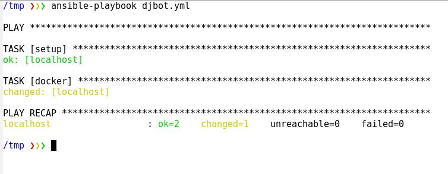  

## Modelado de datos

SQLAlchemy es una caja de herramientas escrita en Python, para gestionar bases de datos SQL. Para SQLAlchemy, las bases de datos no son simples tablas de datos, sino motores de álgebra relacional. La herramienta ofrece una solución de mapeo que permite que las representaciones de los datos en el lenguaje de programación y en la base de datos se desarrollen y evolucionen de manera desacoplada.  

Esta característica que distingue a SQLAlchemy de otras herramientas para trabajar con bases de datos se conoce como mapeador de objetos relacionales (ORM<a id="fnr.10" class="footref" href="#fn.10">10</a>, por sus siglas en inglés). El mapeador hace posible que se amplíe el esquema de la base de datos sin que por eso se amplíe el modelo de datos, y viceversa.  

La esencia de SQLAlchemy consiste en exponer todos los detalles del SQL y de los objetos relacionales en herramientas transparentes, para que estén al alcance de los usuarios. Así, la librería automatiza las tareas redundantes, mientras que los desarrolladores mantienen el control sobre cómo construir el SQL de su base de datos.  

## Diseño de interacciones

Flask es un *microframework* para desarrollo web, escrito en Python. Como tal, ofrece la estructura base para procesar peticiones de HTTP<a id="fnr.11" class="footref" href="#fn.11">11</a>. Respetando el esqueleto de Flask, el usuario goza de total libertad para elegir la base de datos y las demás herramientas que utilizará.  

La tarea principal de Flask es establecer relaciones entre nombres de recurso uniformes (URN<a id="fnr.12" class="footref" href="#fn.12">12</a>, por sus siglas en inglés) y funciones de Python. Para este fin, utiliza un archivo de la aplicación, una carpeta de archivos estáticos (*static*) y una carpeta de plantillas (*templates*).  

El funcionamiento de Flask requiere que se cree y se configure una aplicación de Flask. Para configurar esta aplicación es necesario definir todos los URN que podrá solicitar el navegador, y definir el comportamiento de respuesta para cada uno de esos URN. El comportamiento incluye no solo las indicaciones para que la aplicación de Flask haga lo que tiene que hacer, sino también las indicaciones de formato y de contenido para generar las respuestas correspondientes. Como valor predeterminado, las respuestas se devuelven utilizando plantillas predefinidas por el usuario. Otras opciones de respuesta disponibles son las representaciones en formato JSON<a id="fnr.13" class="footref" href="#fn.13">13</a> y en formato XML<a id="fnr.14" class="footref" href="#fn.14">14</a>.  

La aplicación de Flask, las definiciones de URN y las definiciones de comportamiento se encuentran almacenadas en el archivo de la aplicación. Las plantillas, por su parte, se almacenan en la carpeta de plantillas. El resto de archivos no procesables por la aplicación se almacenan en la carpeta de archivos estáticos. Por defecto, estas dos carpetas se almacenan en subdirectorios dentro del árbol de recursos de Python de la aplicación.  

El comportamiento de Flask es altamente personalizable. La herramienta ofrece un núcleo simple pero extensible, para que el usuario pueda agregar las funcionalidades que sean necesarias. Por ejemplo, permite integrar herramientas para utilizar bases de datos, validar formularios, programar aplicaciones desde su interfaz de programación (API<a id="fnr.15" class="footref" href="#fn.15">15</a>, por sus siglas en inglés), configurar interfaces de usuario, etc.  

## Desarrollo web

React es una librería escrita en JavaScript [@JavaScript], diseñada para crear interfaces de usuario. Permite diseñar aplicaciones grandes con datos cambiantes. Cuando los datos cambian, React identifica y actualiza solo las partes relevantes. Su principio fundamental es trabajar con componentes reutilizables. El uso de componentes aislados agiliza mucho las tareas. La escritura de los componentes se realiza en <a id="fnr.16" class="footref" href="#fn.16">16</a>, una sintaxis opcional, similar a HTML<a id="fnr.17" class="footref" href="#fn.17">17</a>, que simplifica la programación.  

Los componentes son el elemento clave de React, puesto que en ellos se encuentran los datos que sufren los cambios. Los componentes de React son nodos de HTML. Cada componente representa un solo nodo. Para poder trabajar con varios nodos dentro de un mismo componente, los nodos deberán obligadamente estar incluidos en un nodo raíz.  

Un componente puede, además, incluir varios componentes. Dado que un mismo dato suele usarse en múltiples lugares dentro de un sitio web, React necesita crear un primer componente padre que agrupe todos los nodos que contienen ese dato en común. Los nodos, a su vez, pasan a estar representados por componentes hijos. Así, React ejecuta la actualización del dato una sola vez en el componente padre y, luego, transfiere esa modificación a los componentes hijos. Como resultado, el dato se actualiza automáticamente en todos los lugares de la interfaz del usuario.  

Los datos de los componentes se representan mediante los atributos *props* y *state*. El atributo *state* es el dato donde React ejecuta el cambio, mediante una función, dentro del componente padre. El atributo *props*, por su parte, es el dato que los hijos reciben del padre, como una propiedad ya actualizada.  

La representación gráfica de los componentes de React se logra a través del *framework* para diseño web Semantic UI [@SemanticUI]. Esta herramienta usa una sintaxis similar a la de lenguajes naturales. Emplea palabras y clases claras, representativas de las distintas funcionalidades, y frases simples. Ofrece múltiples temas reutilizables, y está completamente diseñada con *em*<a id="fnr.18" class="footref" href="#fn.18">18</a>, lo cual permite diseñar los elementos en proporción al tamaño del texto, y ajustar el contenido a distintos tamaños de pantallas, ya sea que se trate de una computadora, una tableta o un teléfono, por ejemplo.  

## Integración de componentes: DJBot

DJBot es una aplicación web especialmente diseñada para la orquestación de salas de computadoras. Su nombre viene de la contracción entre “DJ”, del inglés *disc jockey*, o persona que crea su propia composición musical a partir de la combinación artística de múltiples discos; y “Bot”, de robot, o máquina que realiza tareas automáticas en lugar de una persona. Nuestro DJ hace de director de orquesta, y administra los bots para crear su propia composición de sistemas.  

El funcionamiento de DJBot es posible gracias a la integración de las cuatro herramientas antes descriptas y otras secundarias. En la capa inferior, Ansible brinda el soporte para la ejecución de las tareas de administración. Para este fin, se alimenta de la base de datos gestionada por SQLAlchemy. En la capa superior, los usuarios interactúan con la aplicación a través de la interfaz web desarrollada con React. El intercambio que tiene lugar entre los dos extremos es controlado por Flask. Así, se establece un flujo de trabajo bidireccional entre Flask y las demás herramientas de DJBot.  

A continuación se presenta el esquema de DJBot:  

  

Para configurar Ansible según nuestros fines específicos, utilizamos la API. Los requisitos necesarios para que Ansible funcione se definen creando un  inventario, una lista de máquinas remotas, un conjunto de opciones de conexión, una clase para guardar los resultados de la ejecución y listas de tareas. Los datos necesarios para configurar estos elementos se encuentran almacenados en la base de datos. Como estos datos ya están mapeados desde SQLAlchemy, optamos por configurar el inventario usando solo los datos de la lista de máquinas remotas.  

Por defecto, DJBot se conecta con las máquinas de la sala utilizando el usuario *root* y la clave privada  de SSH (*root*.ssh/id\_rsa).  

A partir del concepto de guía de ejecución de Ansible, se hace una división entre la lista de máquinas remotas y la lista de tareas. Esta separación nos permite hacer distintas combinaciones de tareas y máquinas. Obtenemos mayor libertad para definir qué hacer dónde.  

Para realizar las tareas de administración en paralelo de manera efectiva, ya sea instalar o actualizar sistemas, la comunicación entre la máquina central y las remotas se configura mediante hilos. Cada hilo representa una conexión. Es decir que para completar la misma tarea en todas las computadoras de la sala al mismo tiempo es necesario configurar tantos hilos como máquinas haya en la sala.  

La utilización de Ansible desde la terminal muestra los resultados de ejecución en la misma consola. DJBot cambia radicalmente este comportamiento, para que los resultados estén disponibles en la interfaz web. Para eso, se define una subclase de *CallbackBase* mediante los siguientes métodos:  

-   *v2\_runner\_on\_ok* indica las tareas que funcionaron correctamente;
-   *v2\_runner\_on\_failed* indica las tareas que fallaron, con su respectivo motivo de error; y
-   *v2\_runner\_on\_unreachable* indica las máquinas con las que no se pudo establecer la conexión.

Estos métodos permiten capturar los resultados para presentárselos al administrador en la interfaz web.  

A modo de ejemplo, a continuación se muestra el código necesario para definir una subclase de *CallbackBase*:  

    class ResultsCollector(CallbackBase):
        def __init__(self, *args, **kwargs):
            super(ResultsCollector, self).__init__(*args, **kwargs)
            self.host_ok     = {}
            self.host_unreachable = {}
            self.host_failed = {}
            self.condition = threading.Semaphore(0)
      
        def v2_runner_on_unreachable(self, result):
            self.host_unreachable[result._host.get_name()] = result._result
        
        def v2_runner_on_ok(self, result,  *args, **kwargs):
            try:
                self.host_ok[result._host.get_name()]
            except:
                self.host_ok[result._host.get_name()] = []
            self.host_ok[result._host.get_name()].append(result._result)
    
        def v2_runner_on_failed(self, result,  *args, **kwargs):
            self.host_failed[result._host.get_name()] = result._result
    
        def get_all(self):
            return {'ok': self.host_ok,
                    'unreachable': self.host_unreachable, \
                    'failed': self.host_failed}

Dado que la lista de tareas de Ansible es el más complejo de los elementos configurados en la aplicación, el diseño de la base de datos respeta su formato. Una tarea está compuesta de módulos. Cada módulo, a su vez, está compuesto de parámetros. Entre ellos existe una relación de composición, que se muestra en la siguiente imagen:  

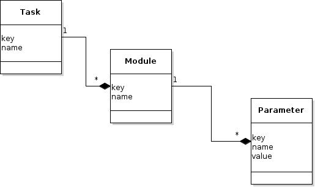  

Adicionalmente, para permitir el envío de archivos desde la máquina central a las remotas, hace falta crear una tabla de archivos en la base de datos.  

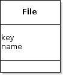  

Esta tabla contiene todos los archivos disponibles para compartir con las máquinas de la sala. Cuando se configura el módulo *copy* de Ansible, Flask busca el archivo que se desea enviar a las máquinas en la base de datos, y se lo entrega a Ansible para que ejecute la tarea.  

El otro requisito de la API que se debe configurar es la lista de máquinas. En nuestro caso, se trata de una lista de salas con sus respectivas computadoras, como se muestra a continuación:  

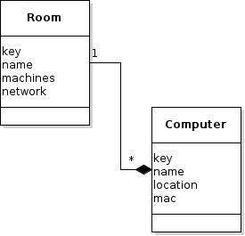  

Los datos relevantes de las salas son el nombre, la cantidad de máquinas que posee y la red en la que se encuentra. En cuanto a las computadoras, nos interesa almacenar un nombre de máquina, una posición dentro de la sala que permita identificar la computadora y la dirección física de red MAC<a id="fnr.19" class="footref" href="#fn.19">19</a>.  

Además de los datos necesarios para configurar la API de Ansible, hace falta definir tres tablas específicas en la base de datos, para representar a los usuarios y sus roles dentro de la aplicación. Los datos básicos para crear un usuario son el nombre de usuario, una dirección de correo electrónico y una contraseña. La tabla de roles, por su parte, incluye el nombre del rol, como por ejemplo *admin* o *user*. Mientras que los usuarios definidos mediante el perfil *user* solo pueden “usar” la aplicación, los usuarios definidos como *admin* tienen, además, permiso para “gestionar” la lista de usuarios. La relación que existe entre los usuarios y sus perfiles, o roles, se define en la tercera de las tablas específicas para este fin; tal como se observa en la siguiente tabla:  

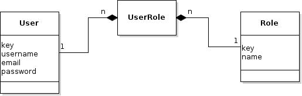  

El diseño completo del modelado de datos es el siguiente:  

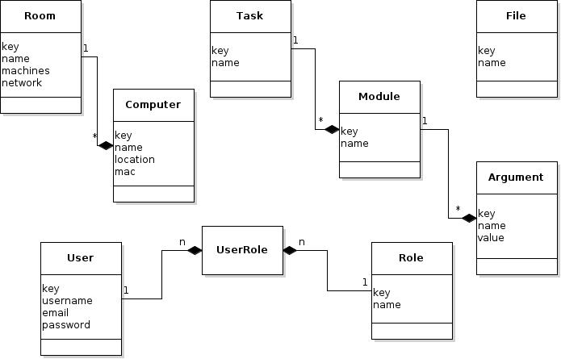  

Este modelado de datos se puede trabajar con distintos tipos de motores de bases de datos. DJBot hace uso del motor de base de datos SQLite [@SQLite]. La principal diferencia entre SQLite y otros motores es que todos los datos se incluyen enteramente en un solo archivo. Esto permite que el motor trabaje más rápido, debido a que los llamados entre funciones son más veloces que la comunicación entre procesos. Una desventaja de este tipo de motor es que no se puede utilizar en aplicaciones distribuidas. Sin embargo, dado que DJBot es una aplicación no distribuida, nuestra herramienta no presenta restricción alguna.  

La navegación del sitio web se realiza únicamente mediante el uso del URN raíz (*/*), y el intercambio de información entre el administrador y DJBot se realiza a través de llamadas asíncronas de JavaScript (AJAX<a id="fnr.20" class="footref" href="#fn.20">20</a>). En el */* se genera un documento HTML completo, que contiene toda las dependencias de hojas de estilos y *scripts*. Las llamadas asíncronas, por su parte, se encargan de realizar las actualizaciones de contenido gracias a la librería React. Estas actualizaciones de contenido son las que permiten agregar o borrar salas, agregar o borrar tareas, definir guías de ejecución determinando qué tareas realizar en qué salas, y recuperar resultados.  

A continuación se presenta la lista de URN que se utilizan en DJBot. Todos los elementos que comienzan con el URN *api* tienen asociada una respuesta en formato JSON. El resto responde con las etiquetas de un documento HTML.  

Estos recursos son utilizados por React para llevar a cabo las acciones que se realizan en la interfaz de usuario.  
A continuación, se puede ver en el gráfico, el árbol de  datos *state* y *props* que se usó como base para en el diseño de la interfaz web.  

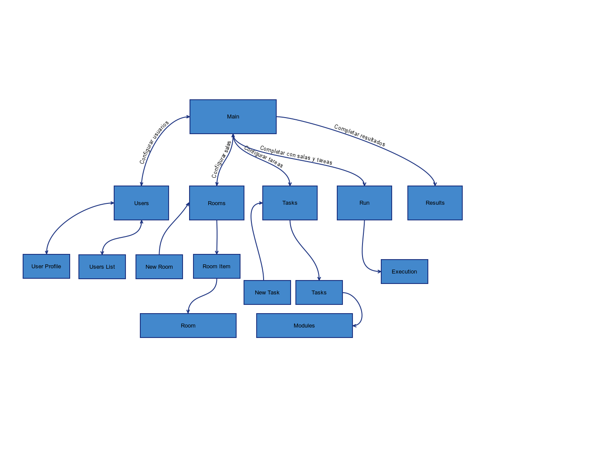  

De manera resumida, DJBot es un conjunto de herramientas especialmente integradas para administrar salas de computadoras en forma centralizada. La conexión entre los datos mapeados por SQLAlchemy y la ejecución de las tareas realizada por Ansible se establece mediante comunicaciones de bajo nivel hechas por Flask. Este *microframework*, a su vez, permite usar la información para completar el modelado de datos en React, y así presentarla de manera clara. Como resultado, se obtiene DJBot: una aplicación web, libre e intuitiva, que hace posible que los administradores de salas de computadoras puedan dirigir su propia orquesta de máquinas, incluso cuando no posean conocimientos específicos en el tema.  

\newpage  

# Implementación y resultados

Para comenzar, en esta sección se presentará una alternativa práctica para descargar e instalar DJBot. Específicamente, se ofrecerán recomendaciones y sugerencias sobre la elección de la computadora central, la instalación de DJBot, la configuración de acceso seguro a la interfaz de DJBot desde un equipo externo a la red, y sobre la configuración de la conexión entre la computadora central y las computadoras remotas. Luego, se describirá cómo navegar por la herramienta para crear usuarios, definir salas de computadoras, definir tareas, ejecutar las tareas deseadas, y para visualizar los resultados. Por último, se ejemplificará la puesta en uso de la aplicación configurando un repositorio caché para mejorar el tiempo de instalación y actualización del software existente en las computadoras de las salas.  

## Instalación

Téngase en cuenta que si bien DJBot es una herramienta de alto nivel, es decir, de fácil uso e intuitiva, requiere de una primera configuración mínima para garantizar su correcto funcionamiento. En caso de que la entidad académica no disponga de especialistas en el área de redes y de seguridad informática, se alienta a que los administradores sigan los pasos que se describen a continuación. Se ha hecho el mayor esfuerzo para concretar la instalación en la menor cantidad de pasos posibles y de la forma más sencilla.  

### Red

Primero se determinará qué recurso de la red oficiará de computadora central, es decir, de computadora donde se instale DJBot. La computadora central debe tener instalada la distribución Debian 8 de GNU/Linux. Además, debe disponer de permisos de conexión con las salas de computadoras. Para esto, el *firewall*, que suele estar configurado en el *router* (consulte la descripción de Arquitectura de red, en la sección Estado del arte), debe permitir las conexiones desde la computadora central hacia los equipos de la sala, y viceversa.  

El diagrama que se presenta a continuación muestra el caso de aplicación:  

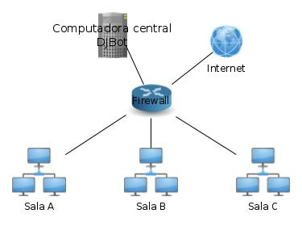  

La manera recomendada de configuración del *firewall* es mediante la implementación de políticas restrictivas. Como valor predeterminado, el *firewall* no permite ningún tipo de conexión, salvo las que se indiquen a través de reglas específicas.  

    iptables -I FORWARD -m state \
             --state RELATED,ESTABLISHED -j ACCEPT
    
    iptables -A FORWARD -m state --state new \
             -p tcp --dport 22 -s <direccion_de_red_de_la_sala> -j ACCEPT
    
    iptables -A FORWARD -m state --state NEW \
             -s <ip_de_maquina_central> -d <direccion_de_red_de_la_sala> -j ACCEPT
    
    iptables -P FORWARD DROP

En la imagen anterior se observa la configuración del *firewall*; donde la primera regla establece que todas las conexiones que hayan sido marcadas como “relacionadas” o “establecidas” serán aceptadas por el *firewall*; la segunda regla permite que la sala tenga conexión a internet; la tercera regla permite el acceso desde la computadora central a las computadoras de las salas remotas; y donde la última regla indica que cualquier otro tipo de conexión distinta de las antes mencionadas será rechazada por el *firewall*.  

La otra opción de configuración disponible sería mediante la implementación de políticas permisivas. Como valor predeterminado, en este caso, el *firewall* acepta todas las conexiones posibles, salvo las que se indiquen a través de reglas específicas.  

### DJBot

La instalación de DJBot en la computadora central se realizará a través de la plataforma Docker (consulte la descripción de Docker en *DevOps*, en la sección Estado del arte). Para este fin, primero será necesario instalar Docker.  

La instalación de Docker se puede realizar desde los repositorios oficiales para la distribución Debian 8 de la aplicación, utilizando el siguiente comando:  

    curl https://raw.githubusercontent.com/krahser/djbot/master/src/docker_install.sh \
        | sudo bash -

A continuación, para completar la instalación de DJBot propiamente dicha, primero se descargará la imagen de la aplicación desde los repositorios públicos de imágenes de Docker. Luego, se creará el contenedor específico para DJBot, con todas las dependencias necesarias para su correcto funcionamiento. Para esto, se ejecuta la sucesión de comandos que aparece a continuación:  

    docker run -d --name DJBot -e VIRTUAL_HOST=djbot.local\
               -e TZ=America/Argentina/Buenos_Aires \
               -p 127.0.0.1:8080:80  \
               --restart always krahser/djbot

Este conjunto de comandos incluye parámetros que permiten la configuración del contenedor. Mediante *&#x2013;name* se le asigna un nombre al contenedor. El parámetro *-d* hace posible la ejecución de la herramienta en segundo plano. Luego se configuran dos variables de entorno (*-e*); una para identificar al contenedor con un nombre virtual, que luego se usará para establecer la conexión mediante HTTPS<a id="fnr.21" class="footref" href="#fn.21">21</a>, y otra para configurar la fecha y la hora locales. El parámetro *-p* relaciona un puerto de la computadora central (por ejemplo, 8080) con el puerto 80 del contenedor (HTTP), lo cual se usará para establecer la conexión mediante SSH. Por su parte, *&#x2013;restart* sirve para configurar el comportamiento del contenedor en caso de fallas, es decir, se le indica que se mantenga funcionando. Por último, se hace referencia a la imagen que se utilizará para crear el contenedor.  

### Conexión Administrador-DJBot

A la hora de acceder a la interfaz gráfica de DJBot, hace falta tener en cuenta el nivel de exposición al que estará sujeta la herramienta. Dado que DJBot permite manipular muchas computadoras, es necesario implementar una política de acceso en cuanto a los usuarios que tendrán permiso para usar la aplicación. De esta manera, se mantiene cierto control sobre la exposición de DJBot, lo cual reduce la posibilidad de accesos no deseados al sistema.  

Con las configuraciones presentadas hasta el momento, solo es posible conectarse a DJBot desde la misma computadora central, a través de HTTP. Escribiendo la URL<a id="fnr.22" class="footref" href="#fn.22">22</a> <http://127.0.0.1:8080> se establece una conexión desde el navegador al puerto del contenedor de la aplicación.  

A fin de que el administrador pueda realizar su trabajo desde cualquier dispositivo y gozar, así, de independencia y de mayor flexibilidad, se ofrecen dos alternativas de conexión con el contenedor de DJBot instalado en la computadora central:  

1.  HTTPS

    La forma más sencilla de resolver esta situación en la práctica general es utilizar una conexión HTTP cifrada, es decir, con certificados de seguridad para la capa de transporte (TLS<a id="fnr.23" class="footref" href="#fn.23">23</a>). Este tipo de conexión, llamada HTTPS, garantiza la confidencialidad de los datos que se intercambiarán entre el dispositivo del administrador y la computadora central.  
    
    A fin de configurar este método, se descarga una segunda imagen (*proxy*) de Docker en la computadora central y se crea el contenedor correspondiente. Esto permite sumar los certificados de seguridad. El comando que se debe ejecutar es el siguiente:  
    
        docker run -v /var/run/docker.sock:/tmp/docker.sock:ro \
               -p 443:443 --restart always -d krahser/djbot-proxy
    
    El parámetro *-v* pone el *socket* de Docker &#x2013;o la lista de contenedores existentes en la computadora central&#x2013; a disposición del contenedor *proxy*. Así, el *proxy* podrá gestionar todas las conexiones que se establezcan entre otros dispositivos y la máquina central. El parámetro *-p* hace posible la conexión HTTPS entre el puerto del contenedor y el puerto de la máquina central. Los parámetros *&#x2013;restart* y *-d* cumplen las mismas funcionalidades antes descriptas. Y finalmente, se hace referencia a la imagen que se utilizará para crear el contenedor *proxy* correspondiente.  
    
    Además, como lo más probable es que la computadora central tenga habilitado el *firewall*, se agregará una regla que permita el acceso al puerto 443, o HTTPS, de esta computadora desde cualquier dispositivo que use el administrador. Para esto, se ejecuta el comando:  
    
        iptables -A INPUT -p tcp --dport 443 \
                 -s <computadoras con acceso a djbot> \
                 -j ACCEPT
    
    Con este contenedor funcionando, ahora se puede acceder a DJBot desde los dispositivos habilitados en el *firewall* de la computadora central, escribiendo la URL <https://><ip\_maquina\_central>.  
    
    A modo de representación gráfica del concepto de la conexión por HTTPS, se presenta el siguiente esquema:  
    
    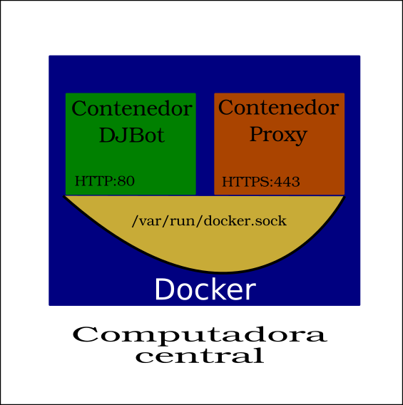  
    
    Sin embargo, incluso cuando se implementan estos certificados de seguridad del *proxy*, DJBot sigue quedando expuesta al haber sido habilitada a través del puerto 443. Por este motivo, se recomienda la configuración de una segunda opción de conexión, que limita el acceso a DJBot a aquellos usuarios que autentiquen su identidad a través de SSH .  

2.  SSH

    SSH no solo permite conectar computadoras remotas para ejecutar comandos, como se analizó en la sección Estado del arte, sino que también permite generar relaciones entre puertos remotos y puertos locales. De esta forma, todo el tráfico de datos se envía cifrado dentro de un túnel de SSH.  
    
    Para utilizar este método es necesario tener acceso a la computadora central a través del puerto 22 (servidor de SSH). Esto implica haber habilitado dicho puerto y haber creado un usuario en la máquina central.  
    
        iptables -A INPUT -p tcp --dport 22 \
                 -s <computadora del administrador> -j ACCEPT
        
        adduser jim
    
    Para establecer la conexión desde el dispositivo del administrador a la computadora central, entonces, alcanza con ejecutar el siguiente comando:  
    
        ssh <usuario>@<ip_maquina_central> -L7904:127.0.0.1:8080
    
    A continuación, la computadora central solicitará la contraseña correspondiente para poder autenticar al usuario en cuestión. Una vez validada la autenticación, establecerá la conexión entre el puerto del contenedor de DJBot en la máquina central (127.0.0.1:8080) y el puerto del dispositivo del administrador (7904).  
    
    A partir de ahora, entonces, el administrador podrá acceder a DJBot escribiendo la URL <http://localhost:7904>, como si estuviese sentado frente a la computadora central. Cada vez que el usuario se conecte a su puerto local, se establecerá el túnel de SSH hacia el puerto remoto de la computadora central.  
    
    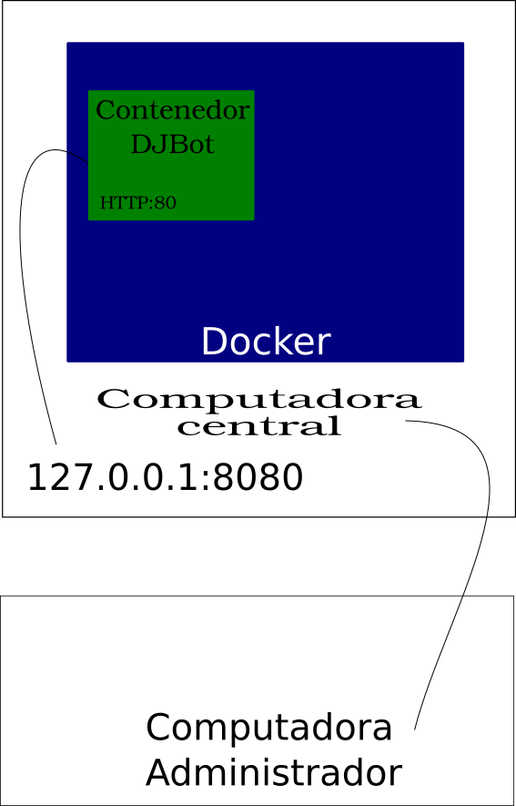   
    
    Este método de conexión ofrece la ventaja de no exponer el puerto de acceso a DJBot desde la web, a través del puerto 443. Sin embargo, el uso de SSH requiere utilizar la consola para conectarse al servicio cada vez que se quiera trabajar. Así y todo, los comandos que se deben ejecutar son lo suficientemente sencillos como para que la configuración pueda ser realizada por personal no especializado en redes y seguridad informática.  

### Conexión DJBot-Salas

Como se describió en la sección Estado del arte, la manera de trabajar a distancia, desde una computadora externa a la red pero habilitada para conectarse con ella, es a través del protocolo SSH. Este protocolo valida las conexiones mediante la presentación de una clave asimétrica RSA. DJBot adopta este método de autenticación por la facilidad de uso y el nivel de seguridad que ofrece.  

Desde el punto de vista de los administradores, se puede pensar en dos escenarios posibles. Si se empieza a trabajar con DJBot y con claves asimétricas desde cero al mismo tiempo, el par de claves se genera automáticamente en el momento de ejecutar el contenedor de DJBot. Copiar la clave pública en cada una de las computadoras remotas sigue siendo responsabilidad del administrador. El funcionamiento del método de autenticación se completa tal como se lo describió con anterioridad.  

Ahora bien, si ya se está trabajando en la administración de salas de computadoras con claves asimétricas RSA pero sin DJBot, la situación se revierte. Para poder aprovechar todas las claves públicas ya copiadas en las máquinas remotas, el administrador deberá agregar la clave privada como parte del proceso de creación del contenedor de DJBot. Para esto, deberá ejecutar el siguiente comando:  

    docker run -d --name DJBot -e VIRTUAL_HOST=djbot.local\
               -e TZ=America/Argentina/Buenos_Aires\
               --restart always  -p 127.0.0.1:8080:80  \
               -v /claves/archivo_clave_privada:/root/.ssh/id_rsa:ro\
               krahser/djbot

donde el parámetro *-v* indica que el archivo de la clave privada que se encuentra en la computadora central pasará como archivo de solo lectura a la carpeta de configuración de SSH para el usuario *root* del contenedor de DJBot.  

## Uso

Con la herramienta debidamente instalada y configurada, el administrador está listo para comenzar su trabajo desde la interfaz web. Para ingresar por primera vez en DJBot, habrá que entrar en la dirección <https://><ip\_maquina\_central> &#x2013;si se optó por el tipo de conexión por HTTPS&#x2013; y, para completar el inicio de sesión, deberá usarse el usuario *admin* y la contraseña *admin*. (Nótese que el usuario creado por defecto tiene rol de administrador.)  

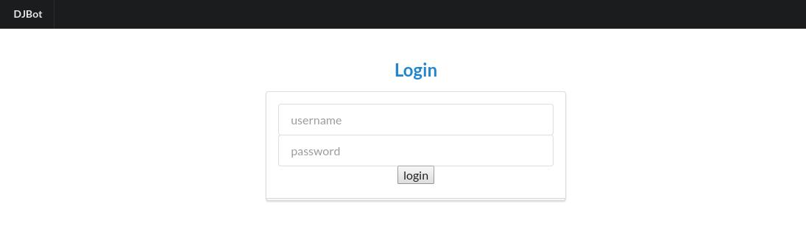   

Acto seguido, se recomienda entrar en la pestaña *Users* para cambiar la contraseña desde *My Profile*.  

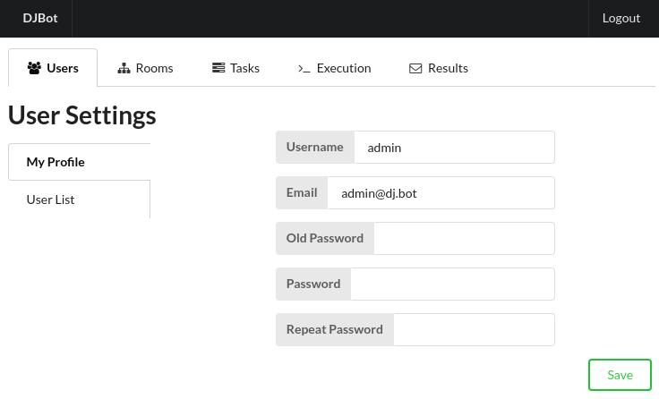   

Para definir las salas que se desean administrar, es necesario entrar en la pestaña Rooms.  

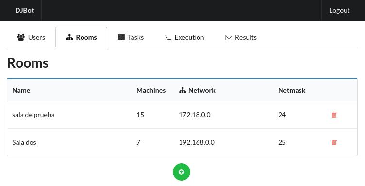  

Haciendo clic sobre el ícono (+), se puede agregar una sala nueva, para la cual habrá que definir un nombre, la cantidad de computadoras que posee, la dirección de red y la máscara de subred. Para borrar una sala, basta con hacer clic sobre el ícono de la papelera de reciclaje.  
Para definir las tareas que se desean realizar en las computadoras de las salas, es necesario entrar en la pestaña Tasks.  

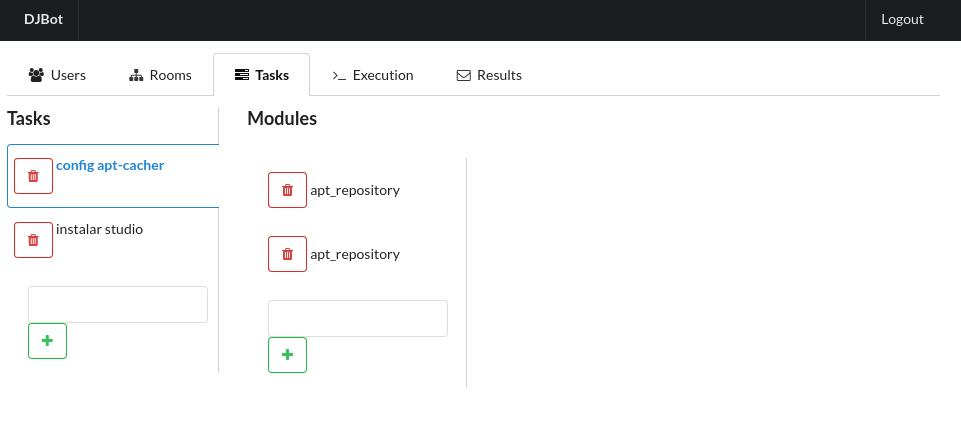   

Las tareas se crean asignándoles primero un nombre y, luego, haciendo clic en el ícono (+). Se recomienda que el nombre sea descriptivo de la funcionalidad principal que realiza cada tarea, para poder identificarlas con mayor facilidad. Una vez más, para eliminar una tarea, basta con hacer clic en el ícono de la papelera de reciclaje.  

La configuración de las tareas se completa definiendo los módulos con sus respectivos parámetros. Los módulos se definen en base a una lista de módulos ya creados por Ansible. Esta lista de módulos ofrece las funcionalidades necesarias para controlar los distintos tipos de recursos del sistema. Los módulos se clasifican según su propósito principal. La lista completa de módulos, con sus respectivos parámetros, se puede consultar en:  

<http://docs.ansible.com/ansible/modules_by_category.html>  

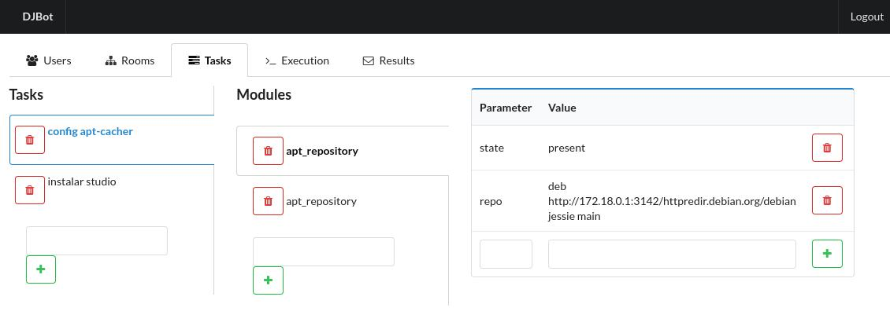   

En la imagen anterior, se visualiza el módulo apt\_repository, que se utiliza para agregar el repositorio en cuestión (consulte la tabla de módulos de Ansible que aparece en Ejecución de tareas, en la sección Solución propuesta). El comportamiento de este módulo está definido mediante el parámetro state, que determina que el repositorio debe estar presente, y mediante el parámetro repo, que indica la ruta del repositorio de los archivos principales.  

El segundo módulo apt\_repository se utiliza para agregar la ruta del repositorio que contiene las actualizaciones de seguridad.  

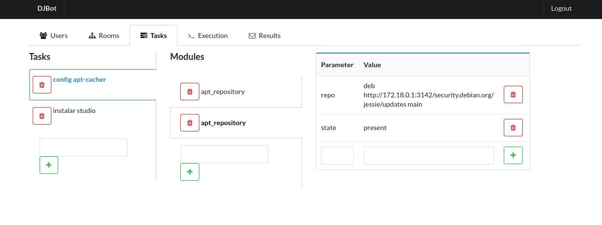  

Una vez definidas las salas y las tareas, con sus respectivos módulos, el administrador podrá enfocarse en la ejecución propiamente dicha de las tareas. Para esto, es necesario entrar en la pestaña Execution, y completar un proceso de tres pasos. Primero, en Where are you working?, se determinan las salas en las que se desea trabajar, seleccionando la casilla que aparece al lado de cada una de las salas correspondientes.  

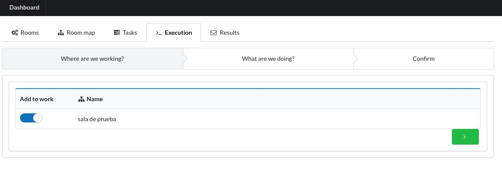   
Luego, en *What are you doing?*, se determinan las tareas que se desean realizar, seleccionando, una vez  más, la casilla de cada una de las tareas correspondientes.  

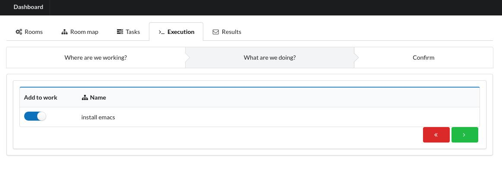   

Y finalmente, en *Are you sure?*, se obtiene una visualización completa de las tareas y las salas seleccionadas, para que el administrador pueda revisar su trabajo y confirmar su ejecución. Si está satisfecho con la selección realizada, basta con hacer clic en el ícono azul (>\_) para que DJBot ejecute la tarea en todas las computadoras de la sala. En este caso, para que configure el uso de un repositorio caché.  

   

La última pestaña, *Results*, muestra los resultados devueltos por DJBot tras la ejecución de las tareas. En la parte superior se indica el nombre de la ejecución en el siguiente formato: nombre de la tarea, más nombre de la sala donde se realizó, más nombre del usuario quien la ejecutó. El administrador tiene la opción de actualizar la lista de resultados disponibles, haciendo clic en el botón azul que aparece a la derecha de la pestaña.  

En la parte inferior, se indica la fecha y la hora de la ejecución, y se visualiza cada una de las máquinas en las que se ejecutaron las tareas, clasificadas según el estado del resultado. El encabezado verde agrupa las máquinas cuyo resultado fue exitoso. El encabezado rojo agrupa las máquinas que sufrieron un error durante la ejecución. Y, por último, el encabezado amarillo agrupa las máquinas con las que no se pudo establecer una conexión desde la computadora central.  

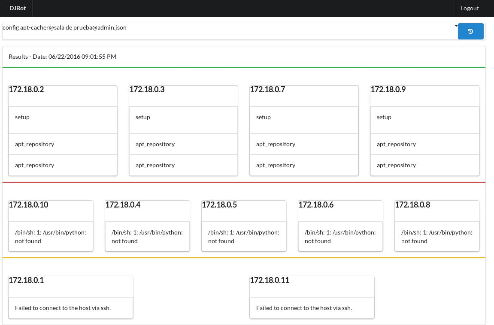  

Con los datos visuales que ofrece la pestaña *Results*, el administrador podrá retomar su trabajo, según corresponda, o bien, dar por completadas sus obligaciones.  

## Validación

La ejecución de la tarea *config apt-cacher*, que se realizó desde DJBot en nuestro ejemplo anterior, agrega una conexión intermedia con un servicio de caché en las computadoras de la sala. La utilización de este servicio permitiría reducir el volumen de datos durante instalaciones o actualizaciones de sistemas, a la vez que mejoraría la velocidad para realizar esas tareas.  

A fin de poder implementar el servicio de caché instalado en las computadoras, antes hace falta que este servicio exista realmente en la computadora central. Para esto, se creará un nuevo contenedor de Docker para *apt-cacher* [@apt-cacher]. El repositorio público de imágenes de Docker ya tiene disponible el software *apt-cacher*, por lo que solo es necesario crear el contenedor correspondiente a la imagen *clue/apt-cacher*. El comando que se debe ejecutar es el siguiente:  

    docker run -d --name apt-cacher --restart always \
                        -p 3142:3142 clue/apt-cacher

donde el parámetro *-p* sirve para relacionar el puerto 3142 del contenedor con el puerto 3142 de la computadora central, lo cual se usará para que las máquinas remotas puedan acceder a *apt-cacher*.  

Para garantizar la conexión entre las máquinas, es necesario configurar el *firewall* del *router* mediante el comando  

    iptables -A FORWARD -p tcp --dport 3142 \
        -s <direccion_de_red_de_la_sala> -d <ip_maquina_central>

para que las computadoras remotas tengan acceso a la computadora central.  

Además, habrá que aplicar una regla en el *firewall* de la computadora central, de modo que las computadoras remotas puedan conectarse con su puerto 3142. El comando que se debe ejecutar es el siguiente:  

    iptables -A INPUT -p tcp --dport 3142 \
        -s <direccion_de_red_de_la_sala> -j ACCEPT

Con el fin de concretar la validación, se crean diez contenedores de Docker, que actuarán como las máquinas de una sala de prueba. Los contenedores se crean a partir de la imagen itscaro/debian-ssh, utilizando el siguiente comando:  

    curl https://github.com/krahser/DJBot/blob/dev/room_example.sh \
         | sudo bash -

Con este escenario planteado, se utiliza DJBot para ejecutar la tarea *config apt-cacher*. Los resultados obtenidos se muestran a continuación:  

\newpage  

# Conclusión

El objetivo teórico de este trabajo ha sido dejar en evidencia el amplio abanico de herramientas que existen, dentro del campo de la informática, para la automatización de tareas, y despertar el interés académico en estas tecnologías nuevas. El objetivo práctico, desarrollar una aplicación para facilitar la administración de salas de computadoras. Se planteó la posibilidad de mejorar una solución propuesta en 2013, con la intención de ofrecer más y mejores funcionalidades, y de elevar el nivel de abstracción en beneficio del usuario final. Se estudió la realidad cambiante que se vive en el sector de las tecnologías de la información, y se descubrieron y analizaron varias herramientas disponibles para reducir o, al menos, simplificar el trabajo de administradores de sistemas. El proceso de gestación, desarrollo e implementación de DJBot trajo múltiples desafíos técnicos e intelectuales. La resolución de estas cuestiones, aunque a veces lenta y dificultosa, nos ha permitido ir perfeccionando la aplicación a lo largo de más de dos años de trabajo. Se espera que la versión actual de DJBot continúe aportando a la eficacia y a la calidad de la labor realizada por el equipo de administradores de la Facultad de Informática de la UNLP, donde ya se está implementando. Y se espera, también, contar con el juicio crítico de los usuarios, para poder seguir mejorando nuestro producto.  

Acorde con los objetivos planteados, este trabajo apunta, por un lado, a la comunidad académica del área de la informática y, por el otro, a los administradores de sistemas. Para comenzar, se describió el escenario de trabajo típico en el contexto de salas de computadoras. Se hizo un repaso de los distintos métodos de trabajo posibles, sea que se trate de una administración manual, remota o centralizada; y se hizo hincapié en el nivel de abstracción de las herramientas disponibles para agilizar la tarea de los administradores. Se presentó el concepto de DevOps, cultura en la que se gesta DJBot.  

Son muchas las herramientas de software libre que existen en el mercado para la automatización de tareas. Sin embargo, la gran oferta de opciones y el nivel de tecnicidad de las herramientas pueden percibirse como obstáculos en algunos casos. Sortear estas dificultades y, más aun, seleccionar los componentes adecuados para la creación de una aplicación nueva exigen mucha dedicación y paciencia. La orquestación de sistemas mediante DJBot es posible tras largas horas de desenredar conceptos para volver a hilarlos según nuestros intereses.  

Las herramientas principales que integran DJBot son cuatro. Ansible brinda el soporte para la ejecución de las tareas de administración propiamente dichas. Para hacerlo, se alimenta de la base de datos SQLite gestionada por SQLAlchemy. Los administradores, por su parte, interactúan con la aplicación a través de la interfaz web desarrollada con React. El intercambio que tiene lugar entre los componentes de la capa inferior (Ansible y SQLAlchemy) y de la capa superior (React) es controlado por Flask. La fusión de estas herramientas ha hecho posible el desarrollo de DJBot: una aplicación web, libre e intuitiva, para administrar salas de computadoras en forma centralizada.  

Luego de haber descripto en detalle suficiente las características y las  
funcionalidades de las distintas herramientas que integran DJBot, se hizo foco en los administradores. A fin de ser coherentes con nuestra meta de que la solución propuesta pueda ser usada por personal técnico no especializado en redes y en seguridad informática, se fue acompañando a los administradores a lo largo del proceso de instalación y uso de la herramienta. A través de ejemplos, sugerencias y de recomendaciones basadas en nuestra experiencia, se guió a los administradores desde la descarga de la aplicación, pasando por la instalación, los métodos de conexión y la implementación, hasta la validación del funcionamiento correcto de DJBot.  

Con documentación registrada sobre algunas herramientas del mundo de *DevOps*, y con DJBot funcionando, se puede afirmar que todos los objetivos y las metas planteadas al comienzo de este trabajo han sido alcanzados. Sin embargo, la naturaleza misma de este tipo de proyectos da lugar a la posibilidad casi constante de seguir mejorando el producto.  

## Trabajos futuros

A continuación se presentan varios puntos para trabajar en el futuro, que aportarían mejoras conceptuales, funcionales y de seguridad a la herramienta:  

-   Adaptar los módulos *command*, *raw*  y *shell* de la lista de módulos de Ansible para incluirlos como tareas ejecutables en DJBot. En la actualidad, estos módulos presentan una estructura singular, diferente de la estructura del resto de los módulos que se usó para construir la base de datos SQLite en DJBot. Se podría definir un parámetro *cmd*, por ejemplo, y asignarle los valores correspondientes del módulo, de manera que se respete la estructura de módulo/tarea general de la herramienta.

-   Mejorar la escritura de algunos de los componentes de React para poder reutilizarlos. Habría que escribir el código con mayor claridad, de manera que los componentes resulten más genéricos. Se eliminaría la repetición de código innecesario y se sacaría mayor provecho de los componentes actuales.

-   Copiar la clave pública de la computadora central de manera automática a través de DJBot en todas las máquinas de la sala. Se evitaría el trabajo manual y repetitivo por parte de los administradores.

-   Permitir la alteración del orden de los módulos después de haber sido creados. Dado que DJBot ejecuta los módulos en el orden en que se presentan en la interfaz web, sería útil que los administradores pudieran cambiar ese orden según lo crean necesario, durante el proceso de definición de módulos o una vez finalizado. En la actualidad, cada módulo creado es inamovible. Ante la necesidad de alterar el orden de los módulos, los administradores se ven obligados a eliminar los módulos y volver a crearlos.

-   Generar el envío automático por correo electrónico de los resultados obtenidos tras la ejecución de las tareas a todos los usuarios registrados en la herramienta. Esta funcionalidad tendría un doble propósito. Serviría para visualizar los resultados en forma inmediata y sin la necesidad de ingresar en la herramienta. Y serviría como método de control de las tareas que van ejecutando.

-   Desarrollar un método gráfico para simplificar la conexión por SSH entre el dispositivo del administrador y la computadora central donde está instalada DJBot. El método de conexión recomendado mediante SSH requiere la ejecución de comandos. Se podría incluir un ícono en el escritorio del dispositivo del administrador, y reducir la escritura de comandos actual a un simple clic.

-   Implementar el método de autenticación descentralizada diseñado por Raúl Benencia en 2014, como método adicional de seguridad.

  
<DJBot.bib>  

<h2 class="footnotes">Nota al pie de p&aacute;gina: </h2>

<a id="fn.1" class="footnum" href="#fnr.1">1</a> 
Del inglés *Secure Shell*, intérprete de órdenes seguro

<a id="fn.2" class="footnum" href="#fnr.2">2</a> 
Acrónimo recursivo del inglés *GNU's Not Unix*, GNU No es Unix

<a id="fn.3" class="footnum" href="#fnr.3">3</a> 
Dirección *IP* versión 4

<a id="fn.4" class="footnum" href="#fnr.4">4</a> 
Del inglés *Internet Protocol*, Protocolo de Internet

<a id="fn.5" class="footnum" href="#fnr.5">5</a> 
Del inglés *Dynamic Host Configuration Protocol*, Protocolo de configuracion dinamica de computadora

<a id="fn.6" class="footnum" href="#fnr.6">6</a> 
Del inglés *Rivest, Shamir y Adleman*, creadores del algoritmo

<a id="fn.7" class="footnum" href="#fnr.7">7</a> 
Del inglés *Redis Queues*, Colas de procesamiento Redis

<a id="fn.8" class="footnum" href="#fnr.8">8</a> 
Tecnología de la información

<a id="fn.9" class="footnum" href="#fnr.9">9</a> 
Del inglés *Structured Query Language*, Lenguaje estructurado de consultas

<a id="fn.10" class="footnum" href="#fnr.10">10</a> 
Del inglés *Object-Relational mapping*, mapeo objeto-relacional

<a id="fn.11" class="footnum" href="#fnr.11">11</a> 
Del inglés *Hypertext Transfer Protocol*, protocolo de transferencia de hipertexto

<a id="fn.12" class="footnum" href="#fnr.12">12</a> 
Del inglés *Uniform Resource Name*, Nombre de Recurso Uniforme

<a id="fn.13" class="footnum" href="#fnr.13">13</a> 
Acrónimo de *JavaScript Object Notation*, notación literal de objetos de JavaScript

<a id="fn.14" class="footnum" href="#fnr.14">14</a> 
Del inglés *eXtensible Markup Language*, lenguaje de marcas Extensible

<a id="fn.15" class="footnum" href="#fnr.15">15</a> 
Del inglés *Application Programming Interface*, interfaz de programación de aplicaciones

<a id="fn.16" class="footnum" href="#fnr.16">16</a> 
Del inglés *JavaScript XML*, leguaje de marcado extensible para JavaScript

<a id="fn.17" class="footnum" href="#fnr.17">17</a> 
Del inglés *HyperText Markup Language*, lenguaje de marcas de hipertexto

<a id="fn.18" class="footnum" href="#fnr.18">18</a> 
Nombre de la la letra M en inglés, que hace referencia al tamaño de la tipografía

<a id="fn.19" class="footnum" href="#fnr.19">19</a> 
Del inglés *Media Access Control*, Control de acceso al medio

<a id="fn.20" class="footnum" href="#fnr.20">20</a> 
Acrónimo de *Asynchronous JavaScript And XML*, JavaScript Asíncrono y XML  

<table>

<colgroup>
<col  class="org-left">

<col  class="org-left">
</colgroup>
<thead>
<tr>
<th scope="col" class="org-left">URN</th>
<th scope="col" class="org-left">Función</th>
</tr>
</thead>

<tbody>
<tr>
<td class="org-left">/[GET]</td>
<td class="org-left">Presenta el documento html válido.</td>
</tr>

<tr>
<td class="org-left">/login[GET]</td>
<td class="org-left">Inicia la sesión del usuario.</td>
</tr>

<tr>
<td class="org-left">/logout[GET]</td>
<td class="org-left">Cierra la sesión del usuario.</td>
</tr>

<tr>
<td class="org-left">/api/room[GET]</td>
<td class="org-left">Presenta la lista completa de salas.</td>
</tr>

<tr>
<td class="org-left">/api/room/add[POST]</td>
<td class="org-left">Agrega una sala.</td>
</tr>

<tr>
<td class="org-left">/api/room/delete[POST]</td>
<td class="org-left">Elimina una sala.</td>
</tr>

<tr>
<td class="org-left">/api/room/discover[POST]</td>
<td class="org-left">Presenta una lista con las máquinas</td>
</tr>

<tr>
<td class="org-left">&#xa0;</td>
<td class="org-left">de la sala que están encendidas.</td>
</tr>

<tr>
<td class="org-left">/api/task[GET]</td>
<td class="org-left">Presenta la lista completa de tareas.</td>
</tr>

<tr>
<td class="org-left">/api/task/add[POST]</td>
<td class="org-left">Agrega una tarea.</td>
</tr>

<tr>
<td class="org-left">/api/task/delete[POST]</td>
<td class="org-left">Elimina una tarea.</td>
</tr>

<tr>
<td class="org-left">/api/task/<id>/module/add[POST]</td>
<td class="org-left">Agrega un módulo a la tarea</td>
</tr>

<tr>
<td class="org-left">&#xa0;</td>
<td class="org-left">con el identificador <id>.</td>
</tr>

<tr>
<td class="org-left">/api/task/<id>/module/delete[POST]</td>
<td class="org-left">Elimina un módulo de la tarea</td>
</tr>

<tr>
<td class="org-left">&#xa0;</td>
<td class="org-left">con el identificador <id>.</td>
</tr>

<tr>
<td class="org-left">/api/task/<id>/parameter/add[POST]</td>
<td class="org-left">Agrega un parámetro a la tarea</td>
</tr>

<tr>
<td class="org-left">&#xa0;</td>
<td class="org-left">con el identificador <id>.</td>
</tr>

<tr>
<td class="org-left">/api/task/<id>/parameter/delete[POST]</td>
<td class="org-left">Elimina un parámetro de la</td>
</tr>

<tr>
<td class="org-left">&#xa0;</td>
<td class="org-left">tarea con el identificador <id>.</td>
</tr>

<tr>
<td class="org-left">/api/run[POST]</td>
<td class="org-left">Realiza una ejecución acorde a</td>
</tr>

<tr>
<td class="org-left">&#xa0;</td>
<td class="org-left">la lista de salas y la lista de tareas.</td>
</tr>

<tr>
<td class="org-left">/api/results[GET]</td>
<td class="org-left">Presenta los resultados</td>
</tr>

<tr>
<td class="org-left">&#xa0;</td>
<td class="org-left">que están disponibles.</td>
</tr>

<tr>
<td class="org-left">/api/results[POST]</td>
<td class="org-left">Recupera el resultado completo</td>
</tr>

<tr>
<td class="org-left">&#xa0;</td>
<td class="org-left">de una ejecución.</td>
</tr>

<tr>
<td class="org-left">/api/user[POST]</td>
<td class="org-left">Presenta los datos del usuario,</td>
</tr>

<tr>
<td class="org-left">&#xa0;</td>
<td class="org-left">según sea admin  o user.</td>
</tr>

<tr>
<td class="org-left">/api/user/add[POST]</td>
<td class="org-left">Agrega un usuario.</td>
</tr>

<tr>
<td class="org-left">/api/user/change\_password[POST]</td>
<td class="org-left">Cambia la contraseña de un usuario.</td>
</tr>

<tr>
<td class="org-left">/api/user/change[POST]</td>
<td class="org-left">Modifica el perfil de un usuario.</td>
</tr>

<tr>
<td class="org-left">/api/user/delete[POST]</td>
<td class="org-left">Elimina un usuario</td>
</tr>
</tbody>
</table>

<a id="fn.21" class="footnum" href="#fnr.21">21</a> 
Del inglés *Hypertext Transfer Protocol Secure*, Protocolo seguro de transferencia de hipertexto

<a id="fn.22" class="footnum" href="#fnr.22">22</a> 
Del inglés *Uniform Resource Locator*, localizador de recursos uniforme

<a id="fn.23" class="footnum" href="#fnr.23">23</a> 
Del inglés *Transport Layer Security*, seguridad de la capa de transporte

